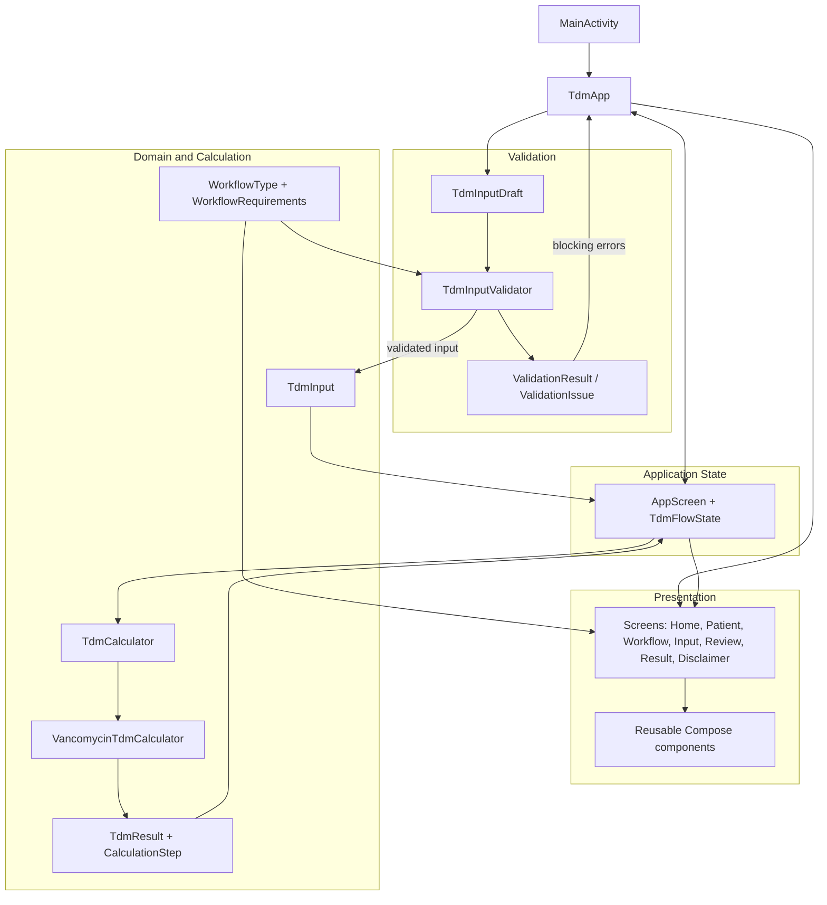
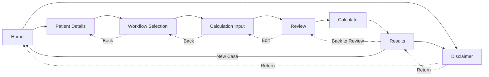

# TDM Insight

**Native Android Therapeutic Drug Monitoring Calculator**

TDM Insight is an academic Android application for structured, source-backed Vancomycin therapeutic drug monitoring calculations. It guides a user through a fictional case, validates workflow-specific inputs, presents a review step, and returns explainable pharmacokinetic results for the supported monitoring workflows.

The application is an **educational software prototype**, not approved clinical or prescribing software.

## Project Overview

Therapeutic drug monitoring calculations require consistent inputs, clear timing definitions, and careful separation between data entry, validation, and mathematical processing. TDM Insight turns that process into a guided native Android workflow built with Kotlin and Jetpack Compose.

A case moves from patient/case details to workflow selection, workflow-specific calculation inputs, validation, review, calculation, and result presentation. Raw text is parsed and validated outside the screen composables, calculation-domain checks are applied before execution, and the Vancomycin equations are implemented in a dedicated calculator rather than inside the UI.

The implemented calculation scope is deliberately narrow: **adult intermittent-IV Vancomycin** using `PRE`, `POST`, and `PRE_POST` workflows.

## Core Features

- Native Android application written in Kotlin with Jetpack Compose and Material 3.
- Guided case flow from Home through patient details, workflow selection, calculation input, review, and results.
- `PRE`, `POST`, and `PRE_POST` Vancomycin monitoring workflows.
- Workflow-driven input presentation so only relevant concentration, timing, renal, and infusion fields are shown.
- Separate structural parsing/validation and calculation-domain validation.
- Source-backed Vancomycin pharmacokinetic calculation engine.
- Review-before-calculation step with explicit input units.
- Explainable results grouped into intermediate values, pharmacokinetic parameters, final values, and calculation steps.
- Back/Edit navigation that preserves entered values and clears stale calculation results when necessary.
- Validation feedback routed to the relevant patient or calculation input screen.
- Academic disclaimer and New Case/reset behavior.
- Unit and regression coverage for calculation, validation, workflow requirements, presentation, and state-flow integration.

## Supported Workflows

| Workflow | Key inputs used by the application | Main calculation capability |
| --- | --- | --- |
| `PRE` | Age, body weight, dose, dosing interval, measured pre-dose concentration | Adult Vd estimate, estimated `Cmax`, measured `Cmin`, elimination rate constant (`Ke`), and half-life |
| `POST` | Age, body weight, dose, dosing interval, measured post-dose concentration, post-sample delay, direct creatinine clearance | Adult Vd estimate, population-based `Ke`, extrapolated `Cmax`, projected `Cmin`, and half-life |
| `PRE_POST` | Body weight, dose, dosing interval, paired pre/post concentrations, post-sample delay, pre/post sample-time difference, infusion duration | Patient-specific `Ke`, half-life, `Cmax`, `Cmin`, Vd, Vd/kg, interval AUC, and `AUC24` |

Units are explicit in the UI: dose in mg, interval/timing in hours, concentrations in mg/L, body weight in kg, and creatinine clearance in mL/min.

## Calculation Outputs

The exact result set depends on the selected workflow. Across the implemented pathways, TDM Insight can return the elimination rate constant (`Ke`), half-life, estimated or extrapolated `Cmax`, `Cmin`, volume of distribution, weight-normalised volume of distribution, intermediate AUC values, and `AUC24` for the paired `PRE_POST` workflow.

`TdmResult` keeps intermediate values, pharmacokinetic parameters, final values, and human-readable `CalculationStep` explanations separate. This allows the result screen to show both the numeric output and how it was obtained without placing equations in Compose code.

Detailed equations and source mapping are intentionally kept out of this README. See the [Calculation Specification](docs/calculation/Calculation_Specification.md), [Source Traceability](docs/calculation/Source_Traceability.md), and [Calculation Flow](docs/calculation/Calculation_Flow.md).

## Source-Backed Calculation Scope

The implemented mathematics follows the approved repository calculation specification. Its documented authorities include the Ministry of Health Malaysia *Clinical Pharmacokinetics Pharmacy Handbook, Second Edition (2019)*, the Ministry of Health Malaysia PhIS/CPS TDM Calculator manual used for Vancomycin workflow/input mapping, and the 2020 ASHP/PIDS/SIDP/IDSA Vancomycin consensus guidance used for AUC context.

The repository's traceability document maps workflow definitions, equations, timing semantics, units, and worked-case regression values to specific source locations. The comparison repository reviewed during the project is explicitly not treated as a clinical authority.

## Safety and Scope Boundary

TDM Insight is an **academic / educational prototype**. It is intended for software-development learning and fictional demonstration cases and is not a substitute for professional clinical judgement.

The implemented scope is adult intermittent-IV Vancomycin pharmacokinetic calculation for `PRE`, `POST`, and `PRE_POST` monitoring. The project does **not** implement pediatric-specific dosing, dialysis dosing, continuous-infusion pathways, unstable-renal-function dose selection, automatic loading-dose selection, autonomous dose adjustment, recommended new-dose generation, or automated treatment advice. It should not be represented as clinically validated, medically approved, diagnostic, prescribing, or autonomous treatment-decision software.

## Technology Stack

| Area | Technology |
| --- | --- |
| Language | Kotlin |
| Platform | Native Android |
| UI | Jetpack Compose |
| Design system | Material 3 |
| State / flow | Compose state + `TdmFlowState` |
| Testing | JUnit; Android test dependencies are also configured |
| Build | Gradle wrapper |
| Android configuration | min SDK 24, target/compile SDK 37 |
| Java compatibility | Java 11 source/target compatibility |

The current repository contains no server, REST API, cloud backend, database, Room persistence, Firebase integration, login service, or runtime clinical API.

## System Architecture

The project keeps presentation, application flow, validation, domain models, and pharmacokinetic calculations separate. `MainActivity` hosts the Compose application. `TdmApp` coordinates screens and draft state, while `AppScreen` and `TdmFlowState` govern progression and back navigation. `TdmInputValidator` converts raw draft values into typed input and enforces workflow/calculation preconditions. The calculation engine receives `TdmInput` through the `TdmCalculator` contract and returns a `TdmResult`; the UI consumes that result without containing the pharmacokinetic equations.



This separation is important for maintainability and verification: input widgets collect values, validation decides whether they are eligible to proceed, and the calculator owns the approved mathematical logic.

## Application Flow

The runtime journey is sequential, with controlled Back/Edit paths and a disclaimer that returns the user to the screen from which it was opened.



Before Review, the app performs safe parsing, workflow-required-field checks, and calculation-domain validation. Calculation errors are surfaced as validation issues rather than silently substituting fallback clinical values.

## Project Structure

```text
app/src/main/java/com/example/tdminsight/
├── calculation/        # Calculator contract, Vancomycin engine, calculation exception
├── model/              # Workflow, input, result, and calculation-domain models
├── navigation/         # AppScreen and TdmFlowState
├── ui/
│   ├── components/     # Reusable Compose components
│   ├── screens/        # Seven application screens + presentation helpers
│   ├── theme/          # Material 3 theme, colors, typography
│   └── TdmApp.kt       # Compose application shell and runtime wiring
├── validation/         # Draft parsing, validation issues/results, calculation gates
└── MainActivity.kt     # Android entry point

app/src/test/java/com/example/tdminsight/
├── calculation/
├── model/
├── navigation/
├── ui/screens/
└── validation/

docs/
├── calculation/
├── diagrams/
├── wireframe/
└── Case_Study_Analysis.md
```

## Testing and Verification

The repository contains focused unit/regression tests for the Vancomycin calculator, structural and calculation-domain validation, workflow requirements, navigation/state transitions, workflow-specific input presentation, review formatting, and calculator-flow integration.

The independent calculation suite covers PRE calculation behavior, the POST population-`Ke` path, the Ministry of Health worked `PRE_POST` case, Vd and Vd/kg, interval AUC and `AUC24`, result units/explanation steps, and invalid mathematical-domain conditions. Later integration tests cover real-calculator flow, navigation transitions, patient-error routing, and result formatting.

The implementation stages were verified with:

```bash
./gradlew test
./gradlew assembleDebug
```

On Windows:

```powershell
.\gradlew test
.\gradlew assembleDebug
```

## Build and Run

1. Clone the repository:

   ```bash
   git clone https://github.com/waseem1302-x/CDE2313-TDM-Insight.git
   cd CDE2313-TDM-Insight
   ```

2. Open the repository in Android Studio.
3. Allow Gradle sync to complete.
4. Select an Android emulator or connected device compatible with min SDK 24 or later.
5. Run the `app` configuration.

For command-line verification, use the Gradle wrapper commands in the testing section.

## Team Contributions

Contribution summaries below are based on merged pull requests, commit authorship, and changed-file history rather than role assumptions.

| Contributor | GitHub | Main contributions evidenced in repository history |
| --- | --- | --- |
| Waseem Mushtaq | [`waseem1302-x`](https://github.com/waseem1302-x) | Core workflow/domain models and navigation contracts; portions of the Compose screen implementation; approved-input model extensions; calculation-domain validation; source-backed `VancomycinTdmCalculator`; connection of calculation results into the TDM flow |
| Muhammad Hasnat Anwar | [`mhasnatanwar`](https://github.com/mhasnatanwar) | Reusable UI components and entry screens; approved calculation specification, source traceability, and calculation-flow documentation; final runnable app integration; navigation/state refinement; Material 3 UI polish; validation/error routing and result presentation tests |
| Khalil Saeed | [`khalilsaeed2040-spec`](https://github.com/khalilsaeed2040-spec) | Structural input validation and validation tests; case-study analysis, wireframes, and design-stage diagrams; independent Vancomycin regression coverage; calculation-readiness, workflow-requirement, presentation, and real/fake calculator-flow integration tests |

The project therefore has shared ownership across domain/calculation engineering, UI/application integration, validation, documentation, and independent verification.

## Technical Documentation

- [Calculation Specification](docs/calculation/Calculation_Specification.md) — approved scope, inputs, units, equations, assumptions, and exclusions.
- [Source Traceability](docs/calculation/Source_Traceability.md) — source-by-source mapping for calculation behavior and worked-case references.
- [Calculation Flow](docs/calculation/Calculation_Flow.md) — workflow-specific calculation dependency flow.
- [Case Study Analysis](docs/Case_Study_Analysis.md) — project analysis and original software-design context.
- [Application Wireframes](docs/wireframe/App_Wireframes.md) — editable design-stage wireframes.
