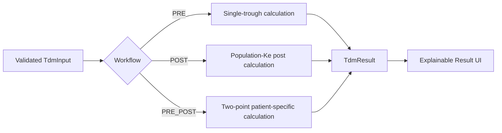
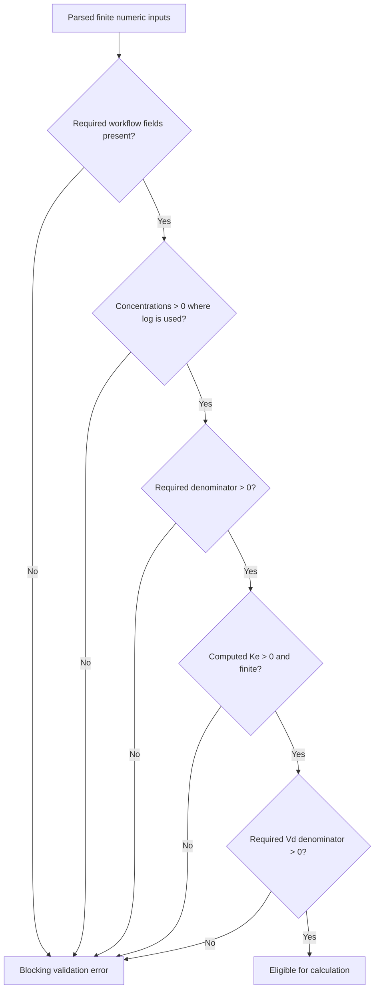

# Vancomycin Calculation Flow

This diagram documents the **approved Stage 3 calculation specification** only. It does not implement clinical code.

## Overall engine boundary



## PRE workflow

```mermaid
flowchart TD
    A[Age + Weight + Dose + Interval + Cpre] --> V[Adult Vd equation]
    V --> CMAX[Cmax = Cmin + Dose / Vd]
    CMAX --> KE[Ke = ln(Cmax/Cmin) / T]
    KE --> HL[t1/2 = 0.693 / Ke]
    HL --> OUT[Return Vd, Cmax, Cmin, Ke, half-life]
```

Source basis: MOH Clinical Pharmacokinetics Pharmacy Handbook, Chapter 15, PDF pp.262 and 272.

## POST workflow

```mermaid
flowchart TD
    A[Age + Weight + CrCl + Interval + Cpost + post delay] --> V[Adult Vd equation]
    A --> KE[Population Ke = 0.0044 + 0.00083 x CrCl]
    KE --> CMAX[Cmax = Cpost x exp(Ke x postDelay)]
    CMAX --> CMIN[Cmin = Cmax x exp(-Ke x T)]
    KE --> HL[t1/2 = 0.693 / Ke]
    V --> OUT[Return Vd, Ke, half-life, Cmax, Cmin]
    CMIN --> OUT
    HL --> OUT
```

Source basis: MOH handbook PDF pp.261-262 and 272; PhIS TDM Calculator manual PDF p.8 confirms the POST workflow and post-sampling timing definition.

## PRE_POST workflow

```mermaid
flowchart TD
    A[Dose + T + Cpre + Cpost + post delay + t2-t1 + BW] --> DT[Elimination denominator = T - (t2 - t1)]
    DT --> KE[Ke = ln(Cpost/Cpre) / denominator]
    KE --> HL[t1/2 = 0.693 / Ke]
    KE --> CMAX[Cmax = Cpost x exp(Ke x postDelay)]
    CMAX --> CMIN[Cmin = Cmax x exp(-Ke x T)]
    CMAX --> VD[Vd = Dose / (Cmax x (1 - exp(-Ke x T)))]
    VD --> VDKG[Vd/BW]

    KE --> AUC{Infusion duration available?}
    AUC -->|Yes| T2[t'' = infusion duration + post delay]
    T2 --> CO[Co = Cmax x exp(Ke x t'')]
    CO --> AI[AUC interval = (Co - Cmin) / Ke]
    AI --> A24[AUC24 = AUC interval x (24 / T)]

    HL --> OUT[TdmResult]
    CMIN --> OUT
    VDKG --> OUT
    A24 --> OUT
```

Source basis: MOH handbook PDF pp.272-273; worked-case verification PDF pp.275-276.

## Formula-domain validation gate



These checks are mathematical preconditions. They are not therapeutic-range rules.

## Stage 4 model/UI changes implied by this flow

1. Add a typed `creatinineClearanceMlMin` input for the POST population-Ke pathway.
2. Add `infusionDurationHours` for PRE_POST AUC calculation.
3. Make units explicit in UI labels: mg, hours, mg/L, mL/min, kg.
4. Rename generic timing labels to their source-backed meanings.
5. Keep calculation logic outside Compose.
6. Keep autonomous dosing recommendations outside the first engine.

## Testing ownership note

When Stage 4 calculation code is implemented, the regression/unit-test contribution should be assigned to **Member 3** so that the team retains clear contribution ownership. The MOH worked case on PDF pp.275-276 supplies source-backed expected values for Ke, half-life, Cmax, Cmin, Co and AUC24.