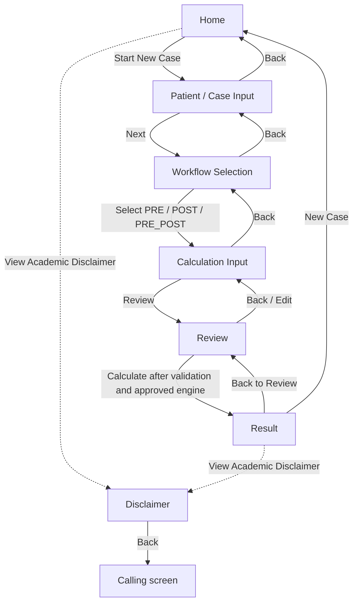

# Application Flow Diagram

This diagram reflects the screen/state flow represented by `AppScreen` and `TdmFlowState`. The full navigation host is not yet connected in `MainActivity`.

## Notes

- The primary case sequence is `Home → Patient Input → Workflow Selection → Calculation Input → Review → Result`.
- Disclaimer access exists in the Home and Result screen designs.
- The transition from Review to Result depends on a future approved `TdmCalculator` implementation; this diagram does not claim that a clinical calculation engine currently exists.
- `MainActivity` integration is outside the current Member 3 stage.
